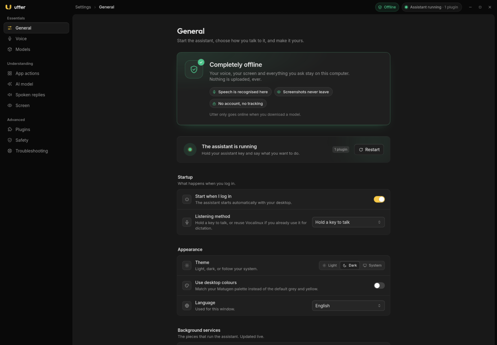
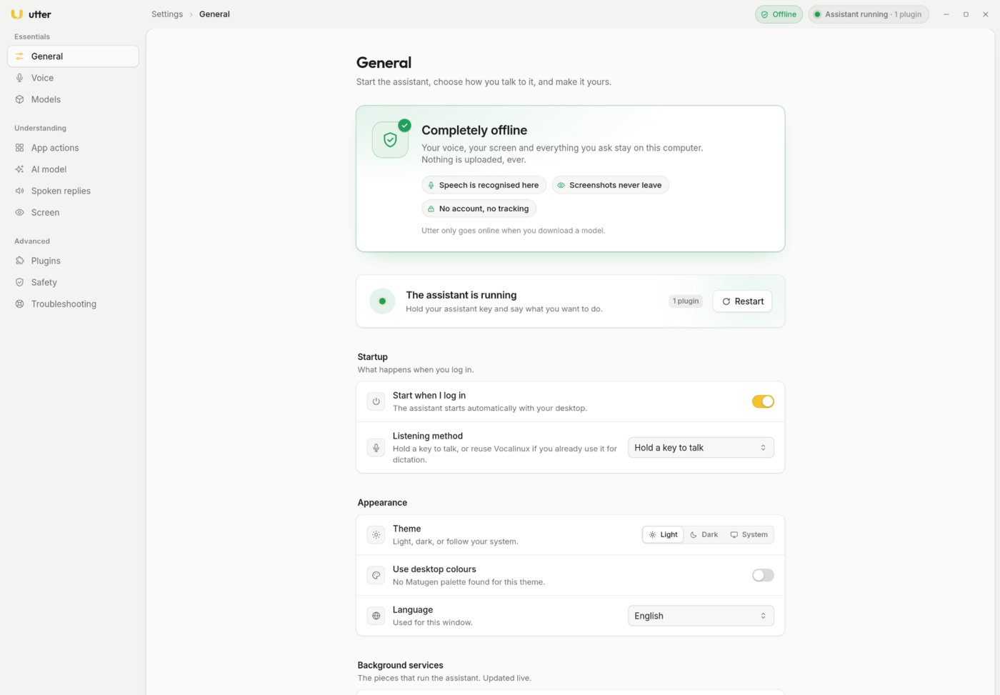

> [!NOTE]
> **Built with AI.** This project, including its code, UI, logo and docs, was created with the help of AI coding assistants and reviewed by a human. Read the code before trusting it with anything important, and please report anything that looks wrong.

<div align="center">

<picture>
  <source media="(prefers-color-scheme: dark)" srcset="docs/media/utter-wordmark-dark.svg">
  
</picture>

### Your voice, turned into actions on your desktop.

**Hands-free, private and completely offline.** Hold a key, say what you want, and Utter does it.

-f7c948)


**📖 Documentation: [sujaisubbanna.github.io/utter-assistant](https://sujaisubbanna.github.io/utter-assistant/)**

</div>

---

## 🎬 Demo

<div align="center">
  <a href="https://sujaisubbanna.github.io/utter-assistant/demo/"></a>
  <br>
  <sub><b>▶ Watch the demo</b> (47 s): “Open YouTube” → “Click the search box” → <i>dictate</i> “Rick Astley, never gonna give you up” → “Press enter” → “Click the first video”. No hands.</sub>
</div>

<!--
  The thumbnail links to the docs site's demo page, which has a real <video>
  player (GitHub's Markdown cannot play a relative file link). For a native
  inline player here as well, edit this README on github.com, drag
  docs/media/utter-demo.mp4 into the editor, and put the user-attachments URL it
  inserts on its own line above.
-->

<details>
<summary>Tour of the settings app</summary>
<div align="center">
  
</div>
</details>

## ✨ What it does

| | |
|---|---|
| 🎙️ **Push-to-talk** | Hold the *assistant key* and speak, or hold the *dictation key* to type what you say into any field. |
| 🪟 **Desktop actions** | Open apps and websites, focus and close windows, switch workspaces, control media, press app shortcuts. |
| 🧠 **Understands context** | Knows which app is focused and what's on screen (via accessibility info first, screenshots only as a last resort). |
| 🧩 **Per-app actions you can edit** | More than 100 app profiles with their shortcuts. Change any key combination from the settings app. |
| 🛡️ **Safe by default** | Risky abilities (terminal commands, raw input) stay off until you turn them on, and important actions ask first. |
| 🌍 **Localised** | The settings app speaks English and Spanish, with more languages easy to add. |

## 🎚️ Two modes, two keys

| | Hold | What happens to your words | On screen |
|---|---|---|---|
| **Assistant** | the *assistant key* (Insert by default) | Turned into an action: open apps and sites, click things, press shortcuts | A yellow waveform |
| **Dictation** | the *dictation key* (F13 by default) | Typed into whatever field has focus | A blue waveform with “Dictation · typing” |

Each mode has its own start sound, so you can tell them apart without looking. Change either key on the **Voice** page of the settings app.

## 😴 Sleep mode

Say **“go to sleep”** (in assistant mode) and Utter frees your graphics card. The AI model services stop, the speech model is unloaded, and only a tiny listener stays alive. **Hold either push-to-talk key to wake it**: speech is back in a fraction of a second, and the bigger models reload in the background.

Utter also **falls asleep by itself** after a while without being used (15 minutes by default). Only *Utter* activity counts: a push-to-talk key, a spoken command, or waking up. Typing and clicking in other apps do not, so the GPU gets freed while you work. It never dozes off mid-sentence or mid-command, and waking is the same key press. Turn it off or change the time on the **General** page (“Sleep when idle”).

The phrase and the timer are up to you. Change them on the **General** page, or in `~/.config/utter/config.toml`:

```toml
[sleep]
trigger = ["go to sleep", "take a break"]
services = ["utter-vision", "utter-planner"]   # what gets unloaded
unload_speech = true
on_idle = true                                 # sleep by itself when unused…
idle_minutes = 15                              # …after this long
```

## 🔒 Completely offline

**Nothing leaves your computer.** Speech is recognised locally, the AI models run locally, and screenshots never leave the machine. There's no account and no telemetry.

The only time Utter goes online is when **you** download a model. If you deliberately point it at a server on another machine, the settings app tells you so in amber.

<div align="center">
<table>
  <tr>
    <td></td>
    <td></td>
  </tr>
  <tr>
    <td></td>
    <td></td>
  </tr>
</table>
</div>

## ⚙️ How it works

```text
  you speak ──▶ speech-to-text ──▶ router ──▶ safety policy ──▶ desktop actions
                 (local model)      │  rules first                  (keys, windows,
                                    │  then a small local AI          apps, media)
                                    ▼  that only *chooses*
                              app & screen context
```

- **Rules first.** Most commands are matched by fast, predictable rules.
- **A small local AI picks, it never invents.** When a rule doesn't match, a constrained model chooses among actions prepared in advance. It can't write its own commands.
- **Screen text can guide, never command.** Anything read from the screen, window titles or the clipboard can only *select* between prepared options.

Under the hood, a tiny **runner** supervises swappable **plugins** (speech, decision, perception, actions, speech output, UI) over one versioned protocol. See [`docs/ARCHITECTURE.md`](docs/ARCHITECTURE.md).

## 🚀 Getting started

> **Requirements:** Linux on Wayland (niri is the first-class target), PipeWire, and Python 3.12+.
> An NVIDIA GPU is recommended for the larger models but not required. Building the settings app
> needs Node + pnpm and a Rust toolchain.

The installer is an **interactive wizard**: it walks each component — the runner and `assistant`
CLI, the settings app, the background services, speech models and the optional Noctalia widget —
and asks whether you want it. In a terminal, Enter accepts the recommended default; `--yes` accepts
them all non-interactively.

### 1. Clone and install

To keep the repository and install from your own checkout:

```bash
git clone https://github.com/sujaisubbanna/utter-assistant.git
cd utter-assistant

./install.sh --dry-run   # walk the wizard, print the plan, change nothing
./install.sh             # install the components you choose
```

Want the smallest possible install — distro packages and the background service, nothing else?

```bash
install/install.sh --dry-run
install/install.sh --yes
```

Undo either one with `./install.sh --uninstall`.

### 2. Remote install

No clone needed:

```bash
curl -fsSL https://sujaisubbanna.github.io/utter-assistant/install.sh | bash
```

Piped input is not a terminal, so the wizard cannot prompt there: a bare pipe **prints the plan and
changes nothing**. Pass `--yes` to accept the recommended defaults, or any other flag:

```bash
# recommended defaults, no prompts
curl -fsSL https://sujaisubbanna.github.io/utter-assistant/install.sh | bash -s -- --yes

# native package (.deb/.rpm) through your package manager instead of the AppImage (needs sudo)
curl -fsSL https://sujaisubbanna.github.io/utter-assistant/install.sh | bash -s -- --package --yes

# only these components
curl -fsSL https://sujaisubbanna.github.io/utter-assistant/install.sh | bash -s -- --only core,gui --yes
```

Other flags: `--skip <csv>`, `--with-noctalia`, `--dry-run`, `--uninstall`. Every download is checked
against `sha256sums.txt` from the release.

### 3. Build from source

The assistant core is stdlib-only Python; the settings app is Tauri v2 + React + Tailwind CSS v4.

```bash
# the assistant core, straight from the checkout
python3 -m utter.daemon --text "open youtube" --dry-run
scripts/verify.sh            # unit + e2e + conformance + spike

# the settings app
cd gui-tauri
pnpm install
pnpm tauri build             # release binary (and a .deb) in src-tauri/target/release
pnpm tauri dev               # …or run it with hot reload
```

On Wayland with a dual-NVIDIA setup, launch the built app with the DMABUF renderer disabled —
`./utter-gui` does this for you:

```bash
WEBKIT_DISABLE_DMABUF_RENDERER=1 ./gui-tauri/src-tauri/target/release/utter
```

Writing a plugin? Start from `plugins/fake_py/` (Python) or `plugins/fake_rs/` (Rust) and read
[`docs/PLUGINS.md`](docs/PLUGINS.md).

Once it's installed, open the **Utter settings app**, set your push-to-talk keys on the **Voice**
page, and pick a recommended model on the **Models** page.

## 🗺️ Roadmap

- [ ] **Actions, not just commands** ⭐ *most important*. Let Utter handle whole requests rather than single commands: ask a question and it finds the answer and tells you; ask for an outcome and it works out the steps. For example:
  - *"Launch Control Resonant"*: find the game and start it through Steam.
  - *"Play some jazz"*: open Spotify and start playing jazz.
- [ ] **Optimise for GPUs with less memory**: smaller default models, quantised builds and sharing one GPU between the models, so Utter runs well on 8 GB cards (and on CPU-only machines)
- [ ] **Windows version**
- [ ] **macOS version**
- [ ] **Support for more apps**: more hand-tuned app profiles and actions
- [ ] **Key sequences for app actions**: let one action press several keys in order (e.g. `/`, then type, then Enter) so common steps don't need vision
- [ ] **More text-to-speech voices**: support for other TTS engines beyond eSpeak, Speech Dispatcher and Piper

## 📚 Documentation

The full documentation lives at **[sujaisubbanna.github.io/utter-assistant](https://sujaisubbanna.github.io/utter-assistant/)**
(introduction, install, configuration, apps, models, plugins, trust & safety, troubleshooting).
It is built from `website/` with Astro Starlight; the Markdown sources below remain the
in-repo reference.

| Doc | What's inside |
|---|---|
| [`docs/INSTALL.md`](docs/INSTALL.md) | Installer, background services, the model store and the `assistant` CLI |
| [`docs/CUSTOMISING.md`](docs/CUSTOMISING.md) | Config, hotkeys, speech, AI and vision models, audio |
| [`docs/APPS.md`](docs/APPS.md) | How commands become actions, and adding a new app |
| [`docs/TRUST.md`](docs/TRUST.md) | Safety model: provenance, confirmation and permissions |
| [`docs/PLUGINS.md`](docs/PLUGINS.md) | Writing a plugin |
| [`docs/ARCHITECTURE.md`](docs/ARCHITECTURE.md) | Runner, protocol, plugins, lifecycle |
| [`docs/THEMING.md`](docs/THEMING.md) | Matugen colours for the settings app and widgets |
| [`AGENTS.md`](AGENTS.md) | Repo guide and invariants for contributors and AI agents |


## 📄 License

[Apache-2.0](LICENSE)
