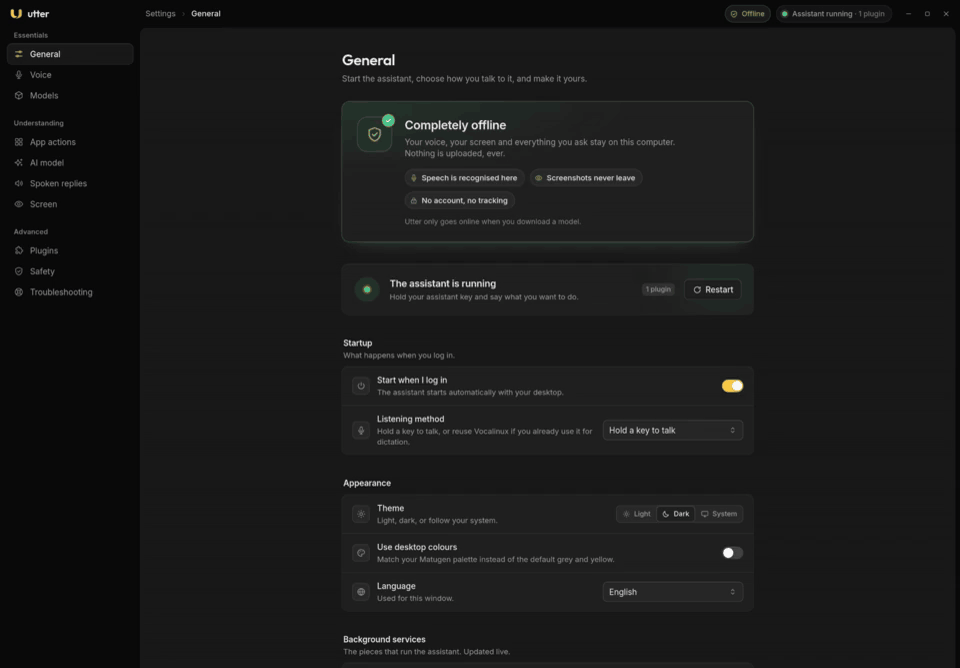
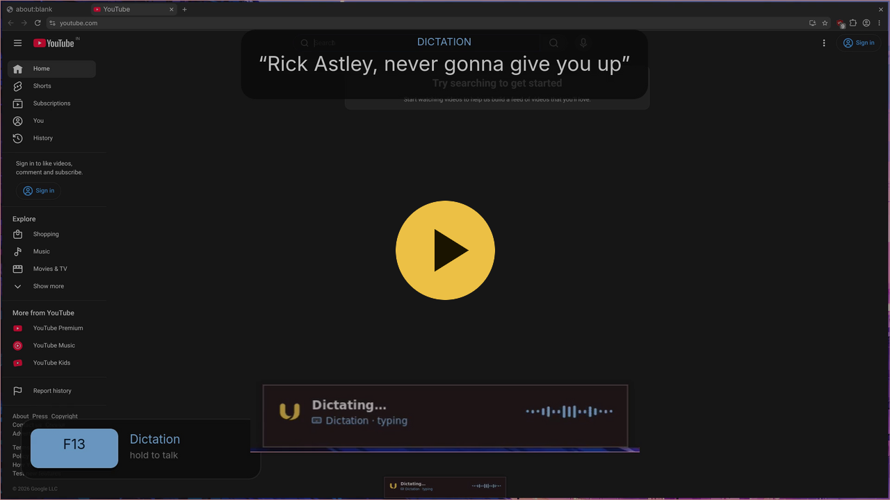

> [!NOTE]
> **Built with AI.** This project, including its code, UI, logo and docs, was created with the help of AI coding assistants and reviewed by a human. Read the code before trusting it with anything important, and please report anything that looks wrong.

<div align="center">

<picture>
  <source media="(prefers-color-scheme: dark)" srcset="docs/media/utter-wordmark-dark.svg">
  
</picture>

### Your voice, turned into actions on your desktop.

**Hands-free, private and completely offline.** Hold a key, say what you want, and Utter does it — or drive the same actions from the command line.

-f7c948)


<a href="https://www.producthunt.com/products/utter-offline-personal-assistant?embed=true&utm_source=badge-featured&utm_medium=badge&utm_campaign=badge-utter-offline-personal-assistant" target="_blank" rel="noopener noreferrer"></a>

**[Documentation](https://utter.sujaisubbanna.com/)** · [Install](#install) · [CLI](docs/CLI.md) · [Roadmap](#roadmap) · [Changelog](CHANGELOG.md)


<br>
<sub><b>Tour of the settings app</b></sub>

</div>

---

## Contents

- [Features](#features) · [Demo](#demo) · [Quick start](#quick-start) · [Use it without voice](#use-it-without-voice)
- [How it works](#how-it-works) · [Install](#install) · [Configure](#configure) · [Plugins](#plugins)
- [Roadmap](#roadmap) · [Documentation](#documentation) · [Trust & safety](#trust--safety) · [Contributing](#contributing) · [License](#license)

## Features

Utter is a context-aware desktop assistant, natively supported on **Linux (Wayland)** — niri first, plus KDE Plasma (KWin) implemented and unit-tested but not yet exercised on a live Plasma session ([docs/PLASMA.md](docs/PLASMA.md)) — and on **macOS** ([docs/MACOS.md](docs/MACOS.md)).

| Feature | What it does |
|---|---|
| Push-to-talk | Hold the *assistant key* to run a command, or the *dictation key* to type what you say into the field you started in (both keys work on Linux and macOS). |
| Desktop actions | Open apps and websites, focus and close windows, switch workspaces, control media, press app shortcuts. |
| Context aware | Knows which app is focused and what is on screen — accessibility info first, screenshots only as a last resort. |
| Target any app | Name the app up front instead of relying on focus: `codex type ok`, `spotify pause`, `close steam`. |
| Editable per-app actions | 100+ app profiles once your installed apps are catalogued, with their shortcuts. Change any key combination in the settings app. |
| Safe by default | Terminal commands and raw input stay off until you enable them, and important actions ask first. |
| Completely offline | Speech, AI models and screenshots never leave your machine. No account, no telemetry. |
| Multilingual | Use it in your own language. 10 UI locales (en, es, de, fr, it, pt, zh, ja, ko, ru); the spoken language is a separate setting, and extra speech models are opt-in. |
| Sleep when idle | Say "go to sleep", or let Utter idle, to free the GPU; hold a push-to-talk key to wake it. |
| Headless CLI | Drive the same commands and settings from a terminal, script or agent, with JSON output. |

### Multilingual

Use Utter in your own language — the settings app ships **10 UI locales** (English, Spanish,
German, French, Italian, Portuguese, Chinese, Japanese, Korean, Russian). The **published web
installer (`curl … | bash`) runs in English only**: the one-line path ships just `install.sh` and
does not carry the translation files, so the installer stays English there. A source checkout or
the full installer tree does speak the same 10 locales. The **spoken language** (speech-to-text
and spoken replies) is a *separate* setting: it resolves `auto` from your system locale, or you
set `[stt] language` / `[tts] language` directly. There are two independent axes, so you can run a
Spanish UI and speak English.

English ships inline. Everything else is **opt-in**: Utter **never downloads a model by itself** —
you pick a language during install or in the settings app, and it offers the matching multilingual
Whisper model (`small`, `large-v3-turbo`, …) and TTS voice. Non-English with an English-only
(`.en`) model warns rather than silently mis-transcribing. See
[spoken language](docs/CUSTOMISING.md#spoken-language-stt--tts) and
[translating](docs/TRANSLATING.md).

## Demo

<div align="center">
  <a href="https://utter.sujaisubbanna.com/demo/"></a>
  <br>
  <sub><b>Watch the demo</b> (47 s): “Open YouTube” → “Click the search box” → <i>dictate</i> “Rick Astley, never gonna give you up” → “Press enter” → “Click the first video”. No hands.</sub>
</div>

## Quick start

1. Run the installer. A real terminal lets the wizard ask about each component:
   ```bash
   curl -fsSL https://utter.sujaisubbanna.com/install.sh -o install.sh
   chmod +x install.sh && ./install.sh
   ```
2. Or install with the recommended defaults, no prompts:
   ```bash
   curl -fsSL https://utter.sujaisubbanna.com/install.sh | bash -s -- --yes
   ```
3. On first launch the settings app opens the **[first-run setup wizard](docs/ONBOARDING.md)** — language, permissions, push-to-talk keys, which apps Utter may control, and a model to run. You can change any of these later on the settings app's **Voice**, **App actions** and **Models** pages. Full walkthrough: [docs/INSTALL.md](docs/INSTALL.md) and [docs/ONBOARDING.md](docs/ONBOARDING.md).

## Use it without voice

Utter ships a full command-line interface, so the same router, safety policy and desktop actions can be driven headlessly from a terminal, a script or an agent — no microphone required.

- `utter` — run commands, discover capabilities, and edit settings and per-app phrases.
- `python -m assistant` — manage the runner, models, recommendations and install state.

```bash
utter assistant "open youtube" --dry-run --json   # preview the plan; nothing runs
utter assistant "open youtube" --confirm --json   # carry it out (explicit)
utter capabilities --json                          # backends, GPU, models, runner status
utter schema --json                                # machine-readable command + error registry
python -m assistant doctor --json
python -m assistant models list --json
```

Every command takes `--json` and returns a stable `utter.cli/v1` envelope. `--dry-run` previews, `--confirm` acts, and read-only commands need no confirmation. Full reference, exit codes and safety behaviour: [docs/CLI.md](docs/CLI.md).

## How it works

```text
  you speak ──▶ speech-to-text ──▶ router ──▶ safety policy ──▶ desktop actions
                 (local model)      │  rules first                  (keys, windows,
                                    │  then a small local AI          apps, media)
                                    ▼  that only *chooses*
                              app & screen context
```

- **Rules first.** Most commands are matched by fast, predictable rules.
- **A small local AI picks, it never invents.** It chooses among actions prepared in advance and cannot write its own commands.
- **Untrusted text can guide, never command.** Screen text, window titles and the clipboard only *select* between prepared options.

A tiny **runner** supervises swappable **plugins** over one versioned protocol. See [docs/ARCHITECTURE.md](docs/ARCHITECTURE.md).

## How Utter compares

| Tool | Open source | Local/offline | Platforms | Voice → actions? |
|---|---|---|---|---|
| **Utter** | Yes (Apache-2.0) | Local by default; no cloud | Linux (Wayland: niri, KDE/KWin) + macOS | Yes |
| **Talon Voice** | No (proprietary) | Local; crash reports + optional metrics | macOS/Windows; Linux/X11 only, no Wayland | Yes |
| **Wispr Flow** | No (proprietary) | Cloud-only | macOS/Windows/Android | No (dictation) |
| **Handy** | Yes (MIT) | Fully offline | Windows/macOS/Linux | No (dictation) |
| **Vocalinux** | Yes (AGPL-3.0) | 100% offline | Linux (X11 + Wayland) | No (dictation) |

Source-checked detail, including where Utter is behind: **[How Utter compares](https://utter.sujaisubbanna.com/guides/comparison/)**.

## Install

Natively supported on Linux on Wayland — niri first, KDE Plasma (KWin) implemented but not yet exercised on a live Plasma session, plus PipeWire — and on macOS, both with Python 3.12+. Full detail: [docs/INSTALL.md](docs/INSTALL.md).

- **Clone:** `git clone https://github.com/sujaisubbanna/utter-assistant.git && cd utter-assistant && ./install.sh` (`--dry-run` previews). Minimal package install: `install/install.sh --yes`; undo with `install/uninstall.sh --yes`.
- **Remote:** `curl -fsSL https://utter.sujaisubbanna.com/install.sh -o install.sh && ./install.sh`. For defaults without prompts, pipe to `bash -s -- --yes`.
- **Agent-driven install:** hand your coding agent [`docs/INSTALL-AGENT.md`](docs/INSTALL-AGENT.md) — a self-contained runbook that installs Utter and verifies each step.
- **Source:** the runner core is stdlib-only Python; the assistant adds a few optional runtime deps (numpy, PyYAML, requests). The settings app is Tauri v2 + React + Tailwind CSS v4 — build it with `pnpm install && pnpm tauri build` in `gui-tauri/`. Run `scripts/verify.sh` for the test suites.

## Configure

Settings live in `~/.config/utter/config.toml` and are mostly editable in the settings app: hotkeys, speech and language, AI and vision models, audio devices, and sleep. See [docs/CUSTOMISING.md](docs/CUSTOMISING.md), or use `utter settings list --json` and `utter settings set`.

## Plugins

Utter is a small runner supervising swappable plugins (STT, decision, LLM, perception, actions, TTS, context, UI) over one versioned protocol. Start from `plugins/fake_py/` (Python) or `plugins/fake_rs/` (Rust); see [docs/PLUGINS.md](docs/PLUGINS.md).

## Roadmap

Shipped: KDE Plasma (KWin) backend (implemented and unit-tested, not yet exercised on a live Plasma session), sleep when idle, the agent CLI, and macOS support. Recent changes: [CHANGELOG.md](CHANGELOG.md). Everything below is still open.

**Command understanding**
- [ ] **Actions, not just commands** *(most important)* — handle whole requests rather than single commands: ask for an outcome and Utter works out the steps (for example, *"Play some jazz"* opens Spotify and starts jazz).

**Platforms and performance**
- [ ] **Windows version.**
- [ ] **Run well on less memory** — smaller default models, quantised builds and one shared GPU, so 8 GB cards and CPU-only machines work.
- [ ] **End-to-end task benchmark** — run a small set of real spoken scenarios in a throwaway compositor and score whether the task actually completed (closer to what other assistants publish than the internal plan-accuracy harness, which only checks routing).

**Memory and personalisation**
- [ ] **Personal memory with [mem0](https://github.com/mem0ai/mem0)** — remember standing preferences instead of asking every time. **Not implemented yet.**
  - When it ships it will store small facts, not transcripts; each entry keeps its source and a confidence. Consulted before the rules, and only as candidates that *select* among prepared actions (never author `args`).
  - It will be **local and offline** and **opt-in**, written on an explicit *"remember that…"* or after accepting a suggestion twice, under `~/.local/share/utter/memory/`, with `memory list|search|forget|export`. It will be **off by default and can be turned off** — off means Utter keeps no memory. It can raise a preference, never a permission, a confirmation or an app override.

**Apps and voices**
- [ ] **More apps** — more hand-tuned profiles and actions.
- [ ] **Key sequences** — let one action press several keys in order (for example `/`, type, Enter) so common steps need no vision.
- [ ] **More TTS voices** — beyond eSpeak, Speech Dispatcher and Piper.
- [ ] **Fully translate the settings app** — a few strings are still hardcoded English (Troubleshooting labels) and the app-targeting note omits the supported-compositor caveat.

**Trust & infrastructure**
- [ ] **Plugin-declared sandbox paths** — `read_paths`/`write_paths` work from the runner config; expose them in the plugin manifest (`utter-plugin.toml`) so a plugin can declare what it needs.
- [ ] **Apply `seccomp`/`landlock`** in the plugin sandbox — today `enforce` applies `NoNewPrivileges`, a private `/tmp`, a default-deny device cgroup and read-only paths, but not syscall filtering.

**Dictation**
- [ ] **Pick the input field** — choose where dictated text goes instead of relying on what is focused, with an accessibility-tree picker and a screen-grid fallback for apps that expose no fields (Electron, web). macOS first; Linux best-effort via AT-SPI.
- [ ] **Local dictation formatting** — clean up transcripts locally: punctuation, filler removal and a per-app tone. Today's tools do this in the cloud; it can run as a small local post-processing pass.

## Documentation

Full documentation: **[utter.sujaisubbanna.com](https://utter.sujaisubbanna.com/)** (built from `website/` with Astro Starlight). The in-repo Markdown sources:

| Doc | What's inside |
|---|---|
| [`docs/INSTALL.md`](docs/INSTALL.md) | Installer, background services, the model store and the `assistant` CLI |
| [`docs/ONBOARDING.md`](docs/ONBOARDING.md) | The first-run setup wizard: steps, skipping, resuming and re-running it |
| [`docs/INSTALL-AGENT.md`](docs/INSTALL-AGENT.md) | Self-contained runbook for an AI agent to install and verify Utter |
| [`docs/CLI.md`](docs/CLI.md) | The `utter` agent CLI: commands, JSON envelope, exit codes, safety |
| [`docs/CUSTOMISING.md`](docs/CUSTOMISING.md) | Config, hotkeys, speech, AI and vision models, audio |
| [`docs/APPS.md`](docs/APPS.md) | How commands become actions, and adding a new app |
| [`docs/TRUST.md`](docs/TRUST.md) | Safety model: provenance, confirmation and permissions |
| [`docs/PLUGINS.md`](docs/PLUGINS.md) | Writing a plugin |
| [`docs/ARCHITECTURE.md`](docs/ARCHITECTURE.md) | Runner, protocol, plugins, lifecycle |
| [`docs/THEMING.md`](docs/THEMING.md) | Matugen colours for the settings app and widgets |
| [`AGENTS.md`](AGENTS.md) | Repo guide and invariants for contributors and AI agents |
| [`CONTRIBUTING.md`](CONTRIBUTING.md) | How to report bugs, suggest features and open a pull request |

## Trust & safety

- **Untrusted content selects, never authors.** Screen, accessibility, OCR, window titles and the clipboard may only choose among precomputed actions — they cannot supply arguments.
- **Risky abilities are opt-in.** `terminal` and raw `input` stay off until explicitly enabled and confirmed; the runner enforces policy, not the plugin.
- **The socket is default-deny** (allow-list plus `SO_PEERCRED`), and handles are capabilities, not paths.
- **What it stores.** Settings, the generated app catalogue, downloaded models and install state; no audio recordings, no transcript or history files, and no screenshots beyond the live session. Transcript text is logged at `INFO` level, so it can appear in the systemd journal until you lower `[daemon] log_level`. Details: [docs/TRUST.md](docs/TRUST.md#8-what-utter-stores).

## Contributing

**Never commit to `main`** — use a feature branch (`fix/…`, `feat/…`, `chore/…`) and open it for review — and **run `scripts/verify.sh`** before declaring anything done. See [CONTRIBUTING.md](CONTRIBUTING.md) for the full guide, and [AGENTS.md](AGENTS.md) for the repo map, contracts and invariants.

## License

Apache-2.0 — see [LICENSE](LICENSE).
