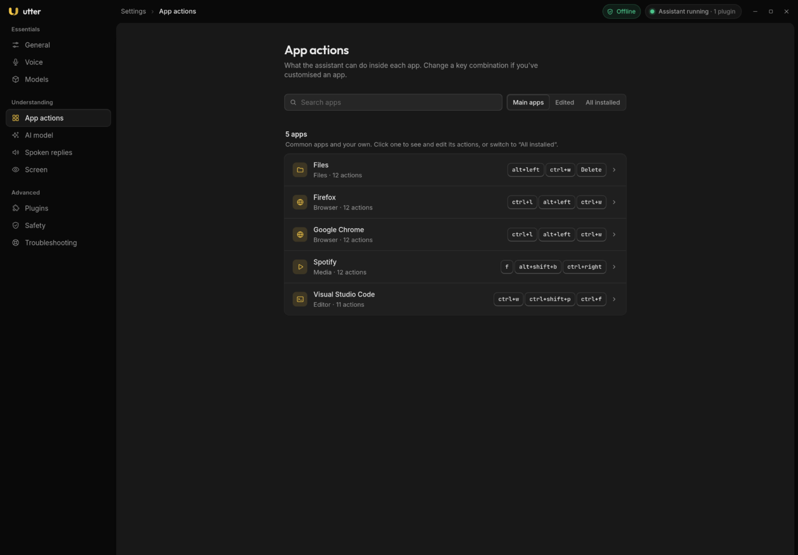
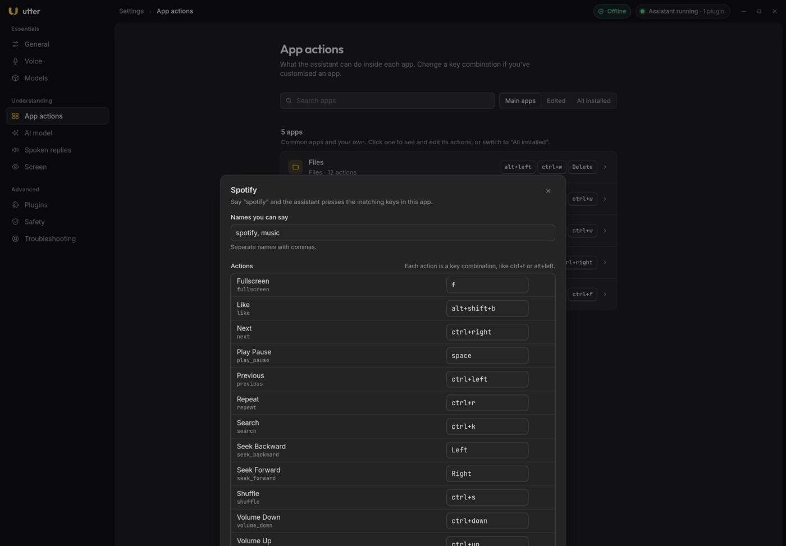

## From utterance to action

```text
utterance ─▶ router ─▶ Plan(steps) ─▶ executor ─▶ action handlers ─▶ desktop
             (rules + constrained decision head)       (T0..T3)
```

The **router** turns what you said into a plan:

1. **Deterministic rules.** Multi-step plans (for example "close youtube" becomes focus, then
   close window) are returned directly.
2. **The constrained decision head.** It enumerates a small set of *fully resolved* candidate
   actions (at most 12 plus a mandatory "none") and asks the local model to choose one by
   letter. A choice below `decide_threshold` is an abstention.
3. **The free-form planner**, consulted only when the decision head is unavailable.
4. **Perception** (accessibility first, vision last) is reached only for "click" steps.

The key safety property: the decision head **chooses among precomputed candidates**; it never
authors free-form arguments. See [Trust and safety](/guides/trust-and-safety/).

### Steps: the action vocabulary

A plan is a list of steps, each an action with arguments, a tier, a description and a confirm
flag. In the Python core the vocabulary is:

| Action | Typical args |
|---|---|
| `open_url` | `{url, new_tab?}` |
| `ensure_url` | `{url, site?}`, context-aware |
| `launch_app` | `{app}` or `{argv}` |
| `ensure_app` | `{app, argv?}`, context-aware |
| `focus_app` | `{app}` |
| `search` | `{query}` |
| `key` | `{chord}` such as `ctrl+t` or `Return` |
| `type_text` | `{text}` |
| `terminal` | `{command, enter?}` |
| `niri` | `{command, args[]}` |
| `media` | `{command}`: `play`, `pause`, `play-pause`, `next`, `previous`, `stop` |
| `click_element` | `{description}`, needs perception |
| `click_point` | `{x, y}` |
| `scroll` | `{direction, amount}` |
| `wait`, `speak`, `done` | none |

In the plugin protocol these are **strings plus JSON Schema**, not a closed enum. A plugin
advertises the ops it really supports.

### The executor

The executor dispatches each step and **re-reads context between steps**; the plan aborts on the
first failed step. `click_element` escalates from the accessibility tree (T1) to vision (T3).

### The contextual resolver

`ensure_url` decides whether to reuse an already-open tab or window, in order:

0. A **browser-tab match** over WebDriver BiDi (Zen browser only, best-effort), including
   background tabs, followed by asking the compositor to raise that window.
1. The focused browser already shows the site (window-title keyword).
2. Another browser window's title matches: focus it.
3. A browser is open: `open_url`, then focus that window.
4. No browser: launch one, or hand the URL to `xdg-open`.

`ensure_app` is simpler: focus a window whose compositor `app_id` matches, else launch it.
Both read live window state from niri. Because niri's `focus-window` does not cross workspaces,
Utter first resolves the window's workspace and focuses that.

## App profiles

App knowledge has layers, and yours win:

| Artefact | Path | Role |
|---|---|---|
| Curated profiles | `utter/profiles/*.yaml` (in the repo) | hand-written per-app rules for common apps |
| Per-kind defaults | `utter/profiles/_defaults.yaml` | shortcuts and search URL inherited by kind |
| **Your profiles** | `~/.config/utter/profiles/*.yaml` | your own apps and edits; the settings app writes here; they win |
| Installed-app catalogue | `~/.local/share/utter/generated.yaml` | a minimal profile for every installed `.desktop` entry, generated per machine |
| Raw catalog | `~/.local/share/utter/apps.json` | parsed `.desktop` entries |

The repository ships a handful of common apps (Firefox, Chrome, VS Code, Files, Spotify) plus
the generic per-kind fallbacks. Anything specific to one machine belongs in your profiles
folder, and the catalogue is generated on each machine.

A profile has these fields: `id`, `name`, `aliases`, `launch`, `terminal`, `new_window`,
`search_url` (must contain `{q}`), `shortcuts` (name to key chord), `app_ids` (compositor app
ids), `mime_types` and `kind`.

Merge rules when the same app appears in several layers:

- **shortcuts are merged**;
- a curated or user `aliases` list **replaces** the generated keyword-derived aliases;
- other fields are replaced;
- kind defaults fill in missing shortcuts and a missing `search_url`.

Name resolution is case-insensitive by `id`, then `name`, then alias, then a token-subset
fallback.

### Building the catalog

`scripts/gen_app_catalog.py` scans `.desktop` files and writes both `apps.json` and
`generated.yaml`:

```bash
scripts/gen_app_catalog.py            # scan and write both artefacts
scripts/gen_app_catalog.py --dry-run  # preview counts only
```

Scan order (highest precedence first): `~/.local/share/applications`, flatpak exports,
`/usr/local/share/applications`, `/usr/share/applications`. Field codes like `%u` are stripped
from `Exec`, `kind` is inferred from `Categories`, and `app_ids` candidates come from
`StartupWMClass`, flatpak ids, the binary basename and the desktop-file id.

## Editing shortcuts in the settings app



The **App actions** page lists your apps. Filter by **All installed**, **Edited** or **Main
apps**, click one, and you get its editor:

- **Names you can say**: the aliases, separated by commas.
- **Actions**: each action is a name plus a key combination such as `ctrl+t` or `alt+left`.
  Change the keys, remove an action or add a new one.
- **Search address**: used for "search ... in this app"; must contain `{q}`.
- **Opens with**: the launch command.
- **Restore built-in** puts the hand-tuned profile back.



Edits are saved to `~/.config/utter/profiles/` and the assistant starts using them after its
next update. Say "new tab" in that app and Utter presses the matching keys.

## niri compositor actions

Phrases map to niri actions through a curated table plus workspace and monitor patterns;
additional phrases are loaded from `utter/data/niri_phrases.json`. The executor runs
`niri msg action <command> [args...]`. Examples: "focus right" is `focus-column-right`,
"fullscreen" is `fullscreen-window`, "workspace 3" is `focus-workspace 3`.

Regenerate the phrase map from your real niri config and the live action list:

```bash
scripts/gen_niri_phrases.py
```

It reads `~/.config/niri/config.kdl` (override with `NIRI_CONFIG`) and the bundled action list.
Every niri action gets an automatic phrase (dashes become spaces) and curated aliases win.

## Terminal, CLI agents and media

- **CLI agents.** Spoken names map to argv (for example "opencode"). If a terminal is focused,
  the agent runs there; otherwise it is launched in a new terminal (`foot -e <agent>`). The list
  lives in `utter/data/cli_agents.json`.
- **Terminal commands.** "run <cmd>" types into a focused terminal. This is a dangerous op and is
  off by default in the runner.
- **Media.** Phrases map to `play`, `pause`, `play-pause`, `next`, `previous` and `stop`, sent to
  the active MPRIS player over D-Bus. This works with any player, from mpv to a browser tab.

## Adding a new application

1. **Create a profile** `~/.config/utter/profiles/<kind>_<id>.yaml` with at least `id`.
   Do not name it `_defaults.yaml` or `generated.yaml`; those names are reserved.
2. **Add aliases** (how you will say it) and **`app_ids`** (the compositor `app_id` or
   `StartupWMClass`; find it with `niri msg --json windows`).
3. *(Optional)* Add a known site to the `SITES` table in `utter/router/rules.py`.
4. *(Optional)* Add a terminal CLI preset to `utter/data/cli_agents.json`.
5. *(Optional)* Add niri bind phrases to the curated list in `scripts/gen_niri_phrases.py` and
   regenerate.
6. **Regenerate catalogs** so the new app and phrases are picked up:
   ```bash
   scripts/gen_app_catalog.py
   scripts/gen_niri_phrases.py   # only if you touched niri phrases
   ```
7. **Verify** with a routing test (below).

A full example for a hypothetical chat app:

```yaml
id: signal
name: Signal
aliases: [signal, signal messenger, signal app]
launch: ["/usr/bin/signal-desktop", "--use-tray-icon"]
terminal: false
new_window: ["/usr/bin/signal-desktop", "--new-window"]
search_url: null
shortcuts:
  new_window: ctrl+n
  find: ctrl+f
app_ids: [signal, Signal]        # niri app_id / StartupWMClass
mime_types: []                   # e.g. x-scheme-handler/sgnl
kind: other                      # browser | terminal | filemanager | editor |
                                 # media | game | office | utility | other
```

Notes:

- Prefer **`launch` as a list** of argv tokens. The launcher spawns the list directly with no
  shell, so field codes are not needed.
- `kind` selects which per-kind defaults apply. Recognised kinds: `browser`, `terminal`,
  `filemanager`, `editor`, `media`, `game`, `office`, `utility`, `other`.
- `search_url` must contain `{q}`.

## Browser tab control over WebDriver BiDi

"Open youtube" should **activate an already-open YouTube tab**, even in a background window,
instead of opening a duplicate. Window titles cannot see background tabs, so the Zen browser is
driven over the **WebDriver BiDi** remote agent.

1. Zen only exposes BiDi when launched with `--remote-debugging-port=9222`. A helper script
   writes a user `.desktop` override that adds the flag:
   ```bash
   scripts/install-zen-bidi-desktop.sh            # writes ~/.local/share/applications/zen-browser.desktop
   scripts/install-zen-bidi-desktop.sh --uninstall
   ```
   `ZEN_BIDI_PORT` overrides the port.
2. `scripts/zen_bidi.py` is a small CLI with `ping`, `list`, `find <substr>`,
   `activate <context>` and `activate-match <substr>`. Find and activate must happen in **one**
   session because BiDi context ids are not stable across sessions.
3. The executor probes `127.0.0.1:9222`, and if the agent is up, activates the matching tab and
   asks niri to raise the window (BiDi selects the tab but does not raise the window on Wayland).
   Any failure falls through to the window-title paths.

Caveats: loopback only; the port must be set at browser start; attaching a WebDriver session is
visible to pages through `navigator.webdriver`, and Utter does not try to hide it.

**Other browsers.** Firefox-family browsers (Firefox, LibreWolf, Waterfox) work the same way:
start them with `--remote-debugging-port`, set `ZEN_BIDI_PORT`, and adapt the `app_id` filter.
Chromium-family browsers use the Chrome DevTools Protocol instead, which the helper does not
speak; `ensure_url` still works for them through window titles, just without background-tab
awareness.

## Verifying a routing change

```bash
# route without executing (prints the plan)
python3 -m utter.daemon --text "open youtube" --dry-run

# the real assistant wrapped as a plugin through the runner
python3 tests/m3/verify_m3.py
```

The real-plugin verification asserts the vertical slice through the runner in dry-run mode: "open
youtube" becomes `ensure_url` for YouTube, "pull up youtube" takes the decision-head path,
"tile right" becomes the niri `move-column-right` action, and the policy checks (a `terminal`
step with screen provenance is rejected; with user provenance it is refused because the op is
disabled). After changing profiles or catalogs, re-run `scripts/gen_app_catalog.py` and check
that the app resolves. The full runner protocol suite is `scripts/verify.sh`.
